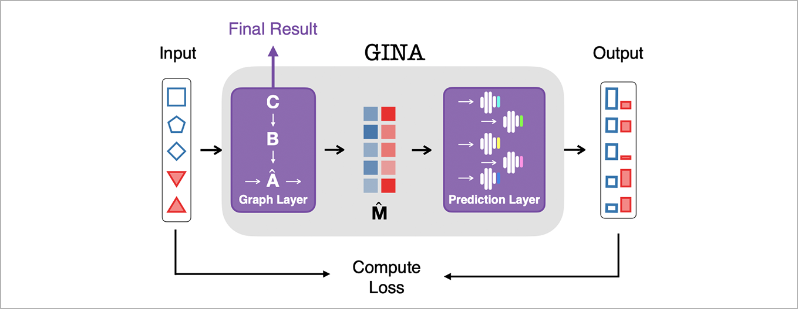

# GINA
Neural Graph Inference From Independent Snapshots of Interacting Systems

[](http://www.gnu.org/licenses/gpl-3.0)


Copyright: 2021, Gerrit Großmann, [Group of Modeling and Simulation](https://mosi.uni-saarland.de/) at [Saarland University](http://www.cs.uni-saarland.de/)


Official implementation of [GINA: Neural Relational Inference From Independent Snapshots](https://arxiv.org/abs/2105.14329)

Version: 0.1 (Please note that this is proof-of-concept code.)


# Overview
Gina takes observations of interacting systems and infers/reconstructs the (latent) underlying interaction graph (contact network). 


Here, we see the successful reconstruction of a 7x7 grid graph. 


# Method
GINA considers each snapshot (observation of all components) individually and tries to predict the observable state of each node, given the measurements of each adjacent node. GINA optimizes the interaction graph in order to maximize the accuracy of this prediction. 




# Usage
Install Python3, Pip3, and Jupyter notebook. Install Python-dependencies with: 

```console
pip3 install requirements.txt
```
Start Jupyter notebook

```console
jupyter notebook
```
and select the `gina.ipynb` file. 

Alternatively, you can upload the  `gina.ipynb` file to [Google Colab](https://colab.research.google.com/?utm_source=scs-index).


(Code comming soon)
